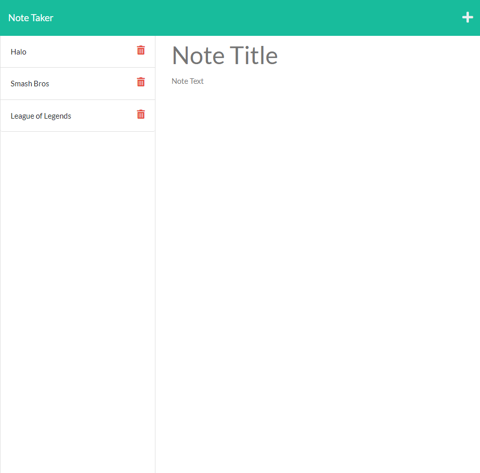

# Note Taker

## Table of Content
* [Description](#description)
* [Instructions](#instructions)
* [Visuals](#visuals)
* [Links](#links)
* [Support](#support)

## Description
A note taking program that lets you save created notes in a list as well as delete them whenever the user desires. 

## Instructions
Have node installed.
Run npm I. 

## Visuals

## Links
GitHub: https://github.com/SupernalDeity/notes-taker

Heroku Live: https://protected-caverns-70968.herokuapp.com/

## Suppport
Send support ticket to perezant121@gmail.com.